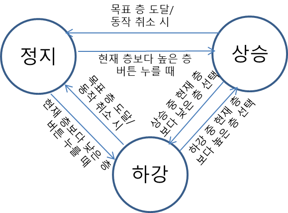
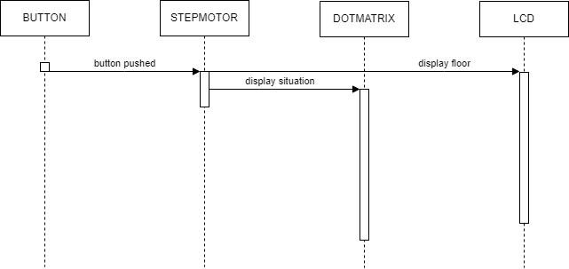

# STM32_Elevator

STM32_Elevator System : Using STM32 RTOS, Multi-threading, GPIO / HW Control
 

## Contents:
 - [프로젝트 개요](#outline)
 - [UML Diagram](#uml-diagram)
 - [결과물](#output)
 - [데모 동영상](#demo-video)
 - [발표 자료](#presentation-document)
 - [개발 명세서](#development-specification)
   

## Outline
프로젝트 주제: STM32F429ZI와 다양한 HW 모듈을 활용한 엘리베이터 만들기  
 
프로젝트 수행자: 인텔 엣지AI SW개발자 아카데미 3기 우창민 
 
프로젝트 수행기간: 24/01/23 ~ 24/01/25 

 
 

## UML Diagram
 - [High Level Design](#finate-state-machine)
  

 - [Sequence Diagram](#sequence-diagram)
   
---

### Finate State Machine

 

---

### Sequence Diagram
서버측 이미지 수신 후 추론 및 HW 제어

 

## Output

## Demo Video
(아래 이미지를 클릭하시면 유튜브로 이동합니다.) 
<!--사진경로, 링크변경 필요-->
 
 
 

## Presentation Document
(아래 이미지를 클릭하시면 구글 슬라이드로 이동합니다.) 
 
 
 

[맨 위로](#top)